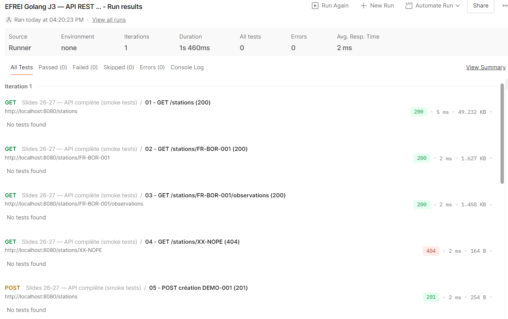
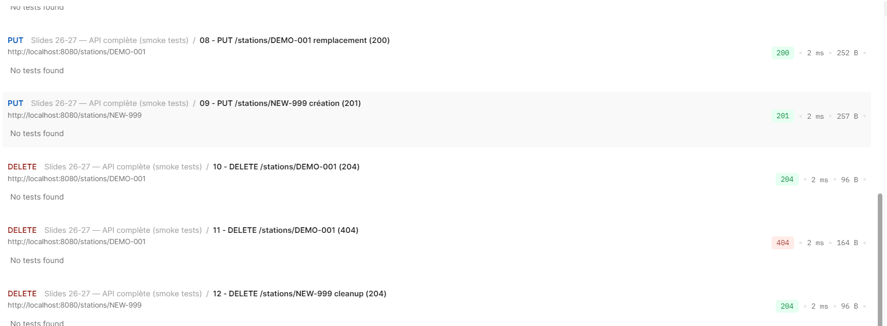

# Weather TP

## Partie A — Comparaison JSON / XML

| Donnée            | JSON                                                           | XML                                                |
|-------------------|----------------------------------------------------------------|----------------------------------------------------|
| Pays              | "Stations"["country"]                                          | attribut country   balise <station>                |
| Coordonnées       | "Stations"["location"{"latitude" , "longitude"}]               | attributs lat, lon   balise <station><coordinates> |
| Altitude          | "Stations"["altitude_m"]                                       | attribut altitude     balise <station><station>             |
| Modèle de capteur | "Stations"["device"{"type"}]                                   | attribut model       balise <station><hardware>             |
| Température       | "Stations"["observations"{"temperature_celsius"}]              | measure type="temperature" balise <station><observation>    |
| Conditions ciel   | "Stations"["observations"{"conditions"}]                       | measure type="sky"       balise <station><observation>      |
| Vent              | "Stations"["observations"{wind("speed_kmh", "direction_deg")}] | speed, "direction"     balise <station><observation<wind>>  |

## Lancer le server
go run ./cmd

## Routes

| Route                         | Méthode | Codes statut  |
|-------------------------------|---------|---------------|
| `/stations`                   | GET     | 200           |
| `/stations/{id}`              | GET     | 200, 404      |
| `/stations`                   | POST    | 201, 400, 409 |
| `/stations/{id}`              | PUT     | 200, 201      |
| `/stations/{id}`              | DELETE  | 204, 404      |
| `/stations/{id}/observations` | GET     | 200, 404      |

## Collection Postman

La validation de l'API a était faite avec la collection `EFREI_Golang_J3.postman_collection.json`.
Pour importer : Postman → File → Import → glisser le fichier .json.
La variable `baseUrl` doit être définie à `http://localhost:8080`.

## capture postman

